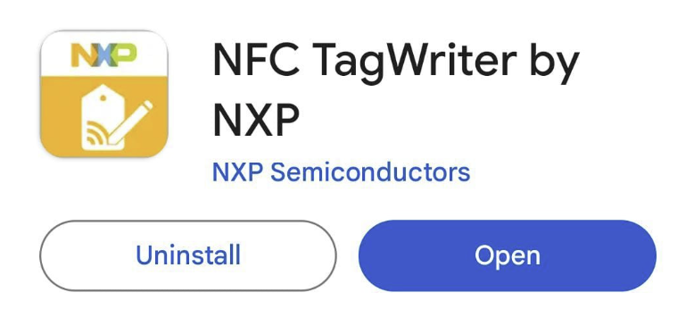
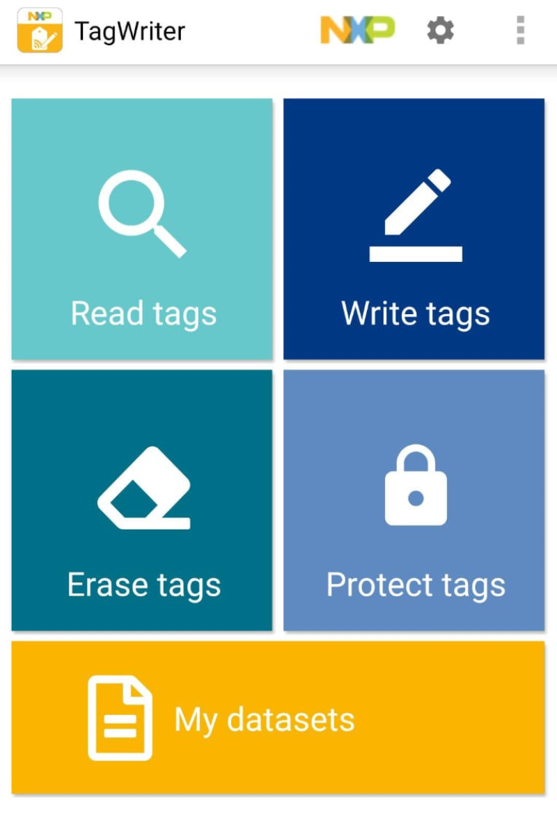
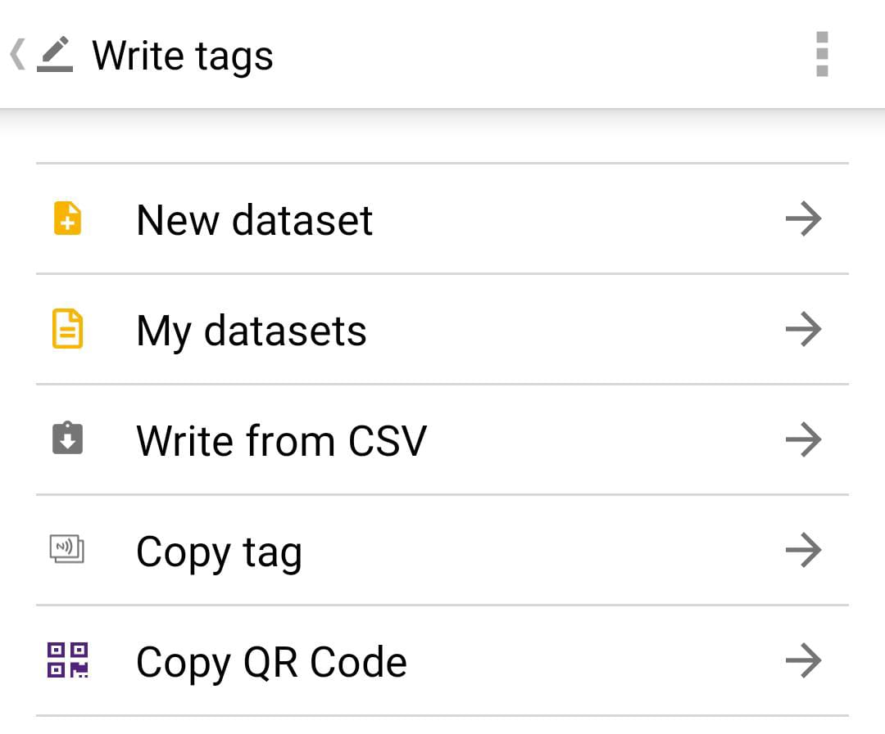
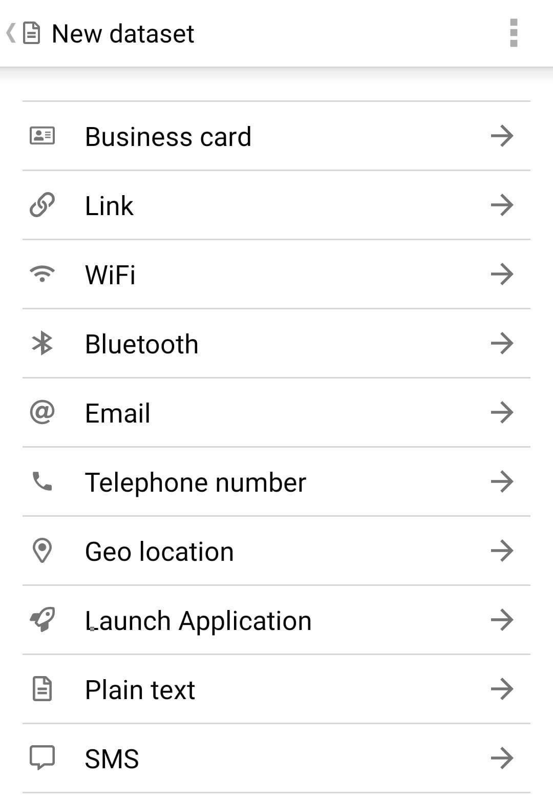

### _By **Appventure**__, NUSH's Computer Science Interest Group_

### **Welcome Message**

Welcome to NUS High! We are Appventure, NUSH's Computer Science Interest Group. Come down to our booth during IG Fair to learn more about us, and follow us on Instagram at **@appventure\_nush** for interesting posts on computer science!

Or: browse this current website you are on, [nush.app](https://nush.app/) which is made by us! 

### **What are NFC Tags?**

Near Field Communication (NFC) allows wireless communication between two electronic devices close to each other, of a distance of up to 1.5 inches (3.81 cm).

The most common example is communication between a device like a smartphone (active - has a power source) and a readable NFC tag (passive - no power source). This communication is possible because the reading device, often your smartphone, can generate a radio frequency (RF) field to power the tag.

NFC tags have many applications! Do your best to use this NFC tag in fun and interesting ways :)

Applications, not limited to the following:
1. Directing people to websites (like in this case), launching applications
2. Contactless payments, making transactions quick and convenient, eg. Google Pay and Apple Pay
3. Automate tasks, eg. Connecting to Wi-Fi or Bluetooth networks, unlocking smart locks, authenticating (2FA) with security key, trigger shortcuts/automation on your phone (eg. iOS Shortcuts, for Android you can use other 3rd party apps)
4. Creative purposes, like sharing media content, creating digital business cards
5. Other cool stuff like setting focus modes, silence your phone, control smart home accessories, play your favorite music, or set timers

### **How to program your NFC Tag**

The NFC tag given is a rewritable NFC tag: As long as you have an NFC tag writer application on your phone and NFC support on your phone, you can program it! Hence, you can reuse it for as many applications as you would like.

**You may need to go to your phone settings to enable NFC.** If there is no NFC support in your settings and you can't get the tag to work, your phone may not support NFC: phones \>= Android 10/iOS 13 should be supported (which is most phones made in the last 6 years)

To read/write the NFC tag, put the NFC tag on the back of your phone, near the camera area. If it doesn't work, try taking off your phone case or moving the NFC tag all over the back of your phone.

**For both Android and IOS**

Download the app "NFC TagWriter by NXP". There are other NFC tag apps you can install that will work (and any will work), but this is one of the most popular.

**The app has the below functions:**
- Read tags – reads the content of the tag. Useful to check what information an unknown tag stores, and see if its malicious or not
- **Write tags** – what we want to do. Write new instructions/information to the tag.
- Erase tags – erase content of tag
- Protect tags – sets a password to your tag to prevent anyone from just overriding it, hence "protecting" it. Warning: once you "lock" your tag (not "protect"), nobody (not even you) can write it again, and it will be read-only, so **do not lock your tag** unless you are very sure that you never want to edit it again!

If you're a fan of long PDFs, you can also refer to the official documentation here, for more advanced functionalities. If there's any feature you don't understand, we encourage you to search it online and find out for yourself!
[https://inspire.nxp.com/tagwriter/tag-writer-user-manual.pdf](https://inspire.nxp.com/tagwriter/tag-writer-user-manual.pdf)

"Dataset" refers to the instructions you want to give your NFC tag. The app automatically saves prior instructions in "My datasets".

1. Press "Write tags", then press "New dataset" to start writing to your NFC tag.

2. Choose what to write from a variety of options, and enjoy!

If you have any queries or still can't get it to work, you can dm **@appventure\_nush** on Instagram or email us at [appventure@nushigh.edu.sg](mailto:appventure@nushigh.edu.sg), or come to our booth during IG Fair! Tag us on Instagram to showcase your creative applications, or tell us during IG Fair :)

We hope you will explore more about NFC tags and use this NFC tag creatively. After all, experiment, explore, excel!

Signing off,
Appventure 2024

(we bought it here if you want more product information)
https://www.amazon.sg/MATCHEASY-Waterproof-Rewritable-Compatible-Rectangular/dp/B0BZHZN7XM/ref=sr_1_3_sspa?adgrpid=98545307246&hvadid=587467106582&hvdev=c&hvlocphy=9062518&hvnetw=g&hvqmt=b&hvrand=11534621183993269782&hvtargid=kwd-299920919263&hydadcr=7631_340284&keywords=nfc%2B215&qid=1700834499&sr=8-3-spons&sp_csd=d2lkZ2V0TmFtZT1zcF9hdGY&th=1
